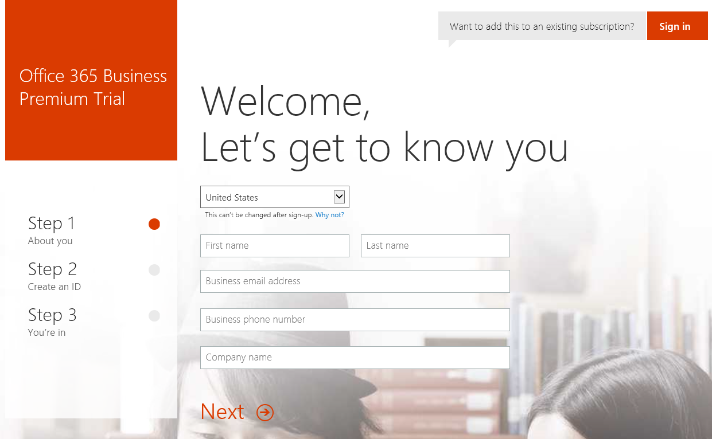
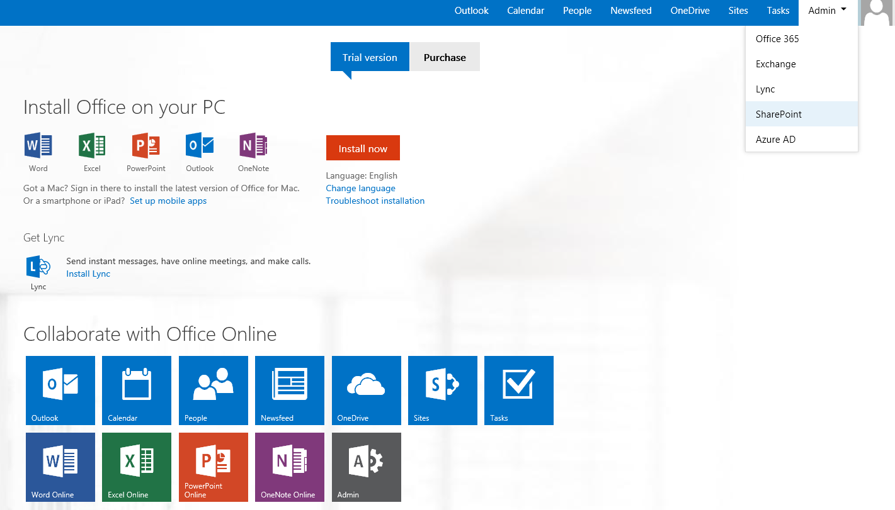
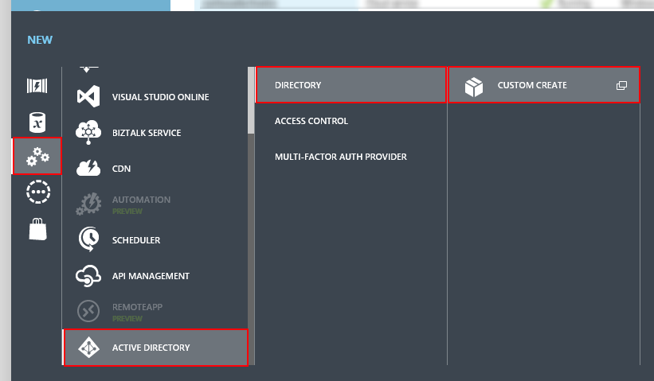
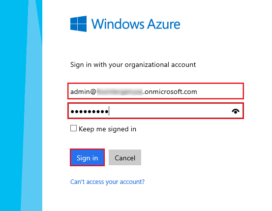

Module 02 - Setting up the Environments
=======================================

##Overview
In this lab, you will create a cloud development environment and build a cloud-hosted app. The development environment will consist of a trial subscription to Office 365 and Azure.

##Objectives
- Set up a developer trial subscription to Office 365
- Set up a developer trial subscription to Microsoft Azure
- Create a basic cloud-hosted app to test the environment

##Prerequisites
- Visual Studio 2013 for Windows 8

##Exercises
The hands-on lab includes the following exercises:<br/>
1. <a href="#Exercise1">Obtain Office 365 and Azure subscriptions</a><br/>
2. <a href="#Exercise2">Create a Provider-Hosted App</a><br/>
3. <a href="#Exercise3">Access a Database using MVC5</a><br/>
4. <a href="#Exercise4">Deploy the App to Production</a><br/>

<a name="Exercise1"></a>
##Exercise 1: Obtain Office 365 and Azure subscriptions
In this exercise you obtain trial subscriptions to Office 365 and Azure. If you already have these subscriptions, you can skip this exercise.

###Task 1 - Sign up for an Office 365 developer subscription
Follow these steps to sign up for an Office 365 developer subscription.
### Request new tenant. ###
  
1. **Start** Internet Explorer 

2.  Browse to address http://office.microsoft.com/en-us/business/redir/XT103040319.aspx 
  a.  This is the trial request for E3 tenants. You can also find the link to this trial option from http://office.microsoft.com. 
  NOTE: The trial request page link may have moved since the writing of this lab. You may need to search for the link in the sub-pages under **Plans & Pricing.**
  

3.  Fill out the form with your personal information accordingly (phone number, email address , company name etc.) and click the ** next ** button below the form to move to next step. 
    

4.  Choose your username and password and click the ** Next ** button below then move to next step. 
    

5.  Enter your mobile phone number, click **Text me**
    
6.  You should be able to recive a register code in a few minutes. Put the code to text box click **Create my account**
    

7.  Remember the information and click the ** You're ready to go ** button below to start the provisioning process. 
  a.  Notice that this is a trial tenant which does not cause you any additional costs, and you don’t have to continue using it afterwards.
    
 
 
8.  Wait for the initial provisioning actions to be completed. This could take anywhere from a few minutes to a half an hour.
    

9.  Click on **SharePoint** from the **Admin** menu. The SharePoint option will be available from the menu, when the tenant provisioning is completed.
    

10.  Choose **Private Site Collection** from the **New** menu.
    

11.  Request new site collection with following settings and click **OK** to proceed with the developer site collection creation
  a.  Title – **Developer**
  b.  Web Site Address – **http://[yourtenant].sharepoint.com/sites/dev**
  c.  Template Selection – **Developer Site**
  d.  Administrator – Your admin account which was provisioned during the tenant provisioning
  e.  Storage Quota – **200 MB**
    
 
12.  Creation of the site collection will take a while, but after it has been created, you are ready to proceed with the actual training exercises.
  a.  Each of the exercise will use the just created developer site collection URL as the target site collection for testing and deploying, so you want to remember this URL during the exercises.

You now have an Office 365 developer subscription to use with the remaining labs.

###Task 2 - Sign up for a Microsoft Azure trial subscription
Follow these steps to sign up for an Azure trial subscription.

1. Navigate to the [Azure Management Portal](https://manage.windowsazure.com)
2. Log in with your account, or create one if you don't have one
Here we will associate your Azure account with your O365 tenant as a global administrator.
This gives you the ability to manage the O365 directory using the Azure portal.


01. Sign into the [Azure Portal](https://manage.windowsazure.com/)

02. Click **+ New**

    

03. Select **App Services > Active Directory > Directory > Custom Create**

    

04. Select **Use existing directory**, and then **I am ready to be signed out now**

    

05. You will be signed out of the portal and redirected to a sign-in page. Sign in using the credentials for a global
    administrator in your O365 tenant.

    

06. When authenticated click **continue**. This will add your Azure account as a global administrator of the O365
    directory.

    

07. Click **Sign out now** and when prompted sign back into your Azure account.

    


You have successfully associated your Azure account with your O365 tenant as a global administrator.
This gives you the ability to manage the O365 directory using the Azure portal.

You now can now use your Microsoft Azure  subscription to use with the remaining labs.

<a name="Exercise2"></a>
##Exercise 2: Create a Provider-Hosted App
In this exercise, you will create a Provider-Hosted app in the new development environment.

###Task 1 - Create the new project in Visual Studio 2013
In this task, you will create a new project.

1. Launch **Visual Studio 2013** as administrator.
2. In Visual Studio select **File/New/Project**.
3. In the New Project dialog:
  1. Select **Templates/Visual C#/Office/SharePoint/Apps**.
  2. Click **App for SharePoint 2013**.
  3. Name the new project **AzureCloudApp** and click **OK**.<br/>
     
4. In the New App for SharePoint wizard:
  1. Enter the address of a SharePoint site to use for testing the app (***NOTE:*** The targeted site must be based on a Developer Site template)
  2. Select **Provider-Hosted** as the hosting model.
  3. Click **Next**.<br/>
     
  4. Select **ASP.NET MVC Web Application**.
  5. Click **Next**.<br/>
     
  6. Select the option labeled **Use Microsoft Azure Access Control Service (for SharePoint cloud apps)**.
  7. Click **Finish**.<br/>
     
  8. When prompted, log in using your Office 365 administrator credentials.

You now have a new Provider-Hosted app project.

###Task 2 - Test the app
In this task, you will test the app you created.

1. Press F5 to begin debugging.
2. When prompted, log in using your Office 365 administrator credentials.
3. When prompted, click **Trust it**.<br/>
     
4. Verify that the app home page shows and that it properly welcomes you by name.<br/>
     

You now have a working Provider-Hosted app

<a name="Exercise3"></a>
##Exercise 3: Access a Database using MVC5
In this exercise, you will add additional functionality to the app to read data from a SQL Azure database.

###Task 1 - Create a Web Site and SQL Azure database
In this task, you will create an Azure Web Role and SQL Azure database for the app.

1. Log into the [Azure Management Portal](https://manage.windowsazure.com) as an administrator.
2. Click **Web Sites**.
3. Click **New**.
4. Click **Custom Create**.<br/>
     
5. Enter a URL for the application. (**NOTE:** URLs must be globally unique, so you will have to choose one not used by another.)
6. Select **Create New Web Hosting Plan**.
7. Select an appropriate Region.
8. Select Create a free 20MB SQL Database.
10. Name the database connection string **AzureCloudData**.
11. Click the Right Arrow.<br/>
     
13. In the **Specify Database Settings**, name the new database **AzureCloudData**.
  1. Select **New SQL database server**.
  2. Name the administrator **AzureCloudAdmin** and enter a password.
  3. Write down the credentials for later!
  4. Pick an appropriate Region.
  5. Click the checkmark.<br/>
     

You now have a new Azure Web Role and SQL Azure database.

###Task 2 - Upload test data to SQL Azure
In this task, you will add some test data for the app.

1. In the Azure portal, click **SQL database**.
2. Click **AzureCloudData** and copy down your database server information.
3. Click **Run Transact SQL Queries Against Your Database**.
4. If prompted to add a firewall rule, click **Yes**.
5. If prompted, select to manage the **AzureCloudData** database.
6. Log in to the database server using the credentials you created earlier.
7. Paste the contents of the following script into the query window.  

   ````sql
   CREATE TABLE [dbo].[Customers](
    [ID] [int] IDENTITY(1,1) NOT NULL,
    [FirstName] [nvarchar](100) NOT NULL,
    [LastName] [nvarchar](100) NOT NULL,
    [Company] [nvarchar](100) NULL,
    [WorkPhone] [nvarchar](100) NULL,
    [HomePhone] [nvarchar](100) NULL,
    [EmailAddress] [nvarchar](100) NULL,
    CONSTRAINT [PK_Customers] PRIMARY KEY CLUSTERED ([ID] ASC))

   GO

   INSERT INTO Customers (FirstName, LastName, Company, WorkPhone, HomePhone, EmailAddress) Values('Gordon', 'Hee', 'Adventure Works Cycles', '1(340)555-7748', '1(340)555-3737', 'someone@example.com')
   INSERT INTO Customers (FirstName, LastName, Company, WorkPhone, HomePhone, EmailAddress) Values('Michael', 'Allen', 'Blue Yonder Airlines', '1(203)555-0466', '1(203)555-0071', 'someone@example.com')
   INSERT INTO Customers (FirstName, LastName, Company, WorkPhone, HomePhone, EmailAddress) Values('James', 'Alvord', 'City Power and Light', '1(518)555-6571', '1(518)555-8576', 'someone@example.com')
   INSERT INTO Customers (FirstName, LastName, Company, WorkPhone, HomePhone, EmailAddress) Values('Jeff', 'Phillips', 'Coho Vineyard', '1(270)555-1720', '1(270)555-7810', 'someone@example.com')
   INSERT INTO Customers (FirstName, LastName, Company, WorkPhone, HomePhone, EmailAddress) Values('Stefen', 'Hessee', 'Contoso, Ltd', '1(407)555-4851', '1(407)555-5411', 'someone@example.com')
   INSERT INTO Customers (FirstName, LastName, Company, WorkPhone, HomePhone, EmailAddress) Values('Christian', 'Hess', 'Fabrikam, Inc', '1(844)555-0550', '1(844)555-3522', 'someone@example.com')
   INSERT INTO Customers (FirstName, LastName, Company, WorkPhone, HomePhone, EmailAddress) Values('Cassie', 'Hicks', 'Fourth Coffee', '1(204)555-6648', '1(204)555-2831', 'someone@example.com')
   INSERT INTO Customers (FirstName, LastName, Company, WorkPhone, HomePhone, EmailAddress) Values('Chris', 'Preston', 'Litware, Inc', '1(407)555-7308', '1(407)555-1700', 'someone@example.com')
   INSERT INTO Customers (FirstName, LastName, Company, WorkPhone, HomePhone, EmailAddress) Values('Diane', 'Prescott', 'Lucerne Publishing', '1(323)555-3404', '1(323)555-7814', 'someone@example.com')
   INSERT INTO Customers (FirstName, LastName, Company, WorkPhone, HomePhone, EmailAddress) Values('Michael', 'Hillsdale', 'Margie Travel', '1(802)555-5583', '1(802)555-0246', 'someone@example.com')
   INSERT INTO Customers (FirstName, LastName, Company, WorkPhone, HomePhone, EmailAddress) Values('Ran', 'Yossi', 'Northwind Traders', '1(250)555-4824', '1(250)555-3653', 'someone@example.com')
   INSERT INTO Customers (FirstName, LastName, Company, WorkPhone, HomePhone, EmailAddress) Values('Arlene', 'Huff', 'Proseware, Inc', '1(248)555-1267', '1(248)555-0302', 'someone@example.com')
   INSERT INTO Customers (FirstName, LastName, Company, WorkPhone, HomePhone, EmailAddress) Values('Julia', 'Isla', 'School of Fine Art', '1(270)555-5347', '1(270)555-3401', 'someone@example.com')
   INSERT INTO Customers (FirstName, LastName, Company, WorkPhone, HomePhone, EmailAddress) Values('Rodrigo', 'Ready', 'Southridge Video', '1(808)555-1110', '1(808)555-4310', 'someone@example.com')
   INSERT INTO Customers (FirstName, LastName, Company, WorkPhone, HomePhone, EmailAddress) Values('Shu', 'Ito', 'Trey Research', '1(844)555-5428', '1(844)555-2117', 'someone@example.com')
   INSERT INTO Customers (FirstName, LastName, Company, WorkPhone, HomePhone, EmailAddress) Values('David', 'Jaffe', 'Wingtip Toys', '1(340)555-4478', '1(340)555-1010', 'someone@example.com')

   GO
   ````

8. Click **Run**.

You now have test data in your SQL Azure database.

###Task 3 - Add an Entity Framework model
In this task, you will create an Entity Framework model for the test data.

1. Right click the **AzureCloudAppWeb** project and select **Manage NuGet Packages**.
2. Type **Entity Framework** in the search box.
3. Click the **Install** button for Entity Framework version 6.<br/>
     
4. After the package is installed, click **Close**.
5. In the **Solution Explorer**, right-click the **Models** folder in the **AzureCloudAppWeb** project.
6. Select **Add/New Item** from the context menu.
7. In the New Item dialog:
  1. Select **Visual C#/Data/ASP.NET Entity Data Model**.
  2. Name the new model **AzureCloudDataModel.edmx**.
  3. Click **Add**.<br/>
       
8. In the Entity Data Model wizard:
  1. Click **EF Designer from Database**.
  2. Click **Next**.<br/>
       
  3. Click **New Connection**.
  4. In the Connection Properties dialog:
    1. Enter the database server information you obtained earlier into the **Server Name** field.
    2. Select **Use SQL Authentication**.
    3. Enter the Administrator credentials for your database server.
    4. Select **AzureCloudData** as the database.
    5. Click **Test Connection**.
    6. Click **OK**.
  5. Select **Yes, include the sensitive data in the connection string**.
  6. Click **Next**.
  7. Check **Tables**.<br/>
       
  8. Click **Finish**.

Now you have an Entity Framework model for the test data.

###Task 4 - Add a Controller
In this task, you will create a new controller to work with the test data.

1. **Build** the AzureCloudAppWeb project.
2. Right-click the Controllers folder and select **Add/Controller**.
  1. Select **MVC5 Controller with views using Entity Framework**.
  2. Click **Add**.<br/>
       
  3. Select **Customer** as the Model Class.
  4. Select **AzureCloudDataEntities** as the Data Context Class.
  5. Click **Add**.<br/>
       

Now you have a new controller for the test data.

###Task 5 - Test the App
In this task, you will use the test data in the app.

1. In the **AzureCloudApp** project, double-click the **AppManifest.xml** file.
2. Update the Start Page to be **AzureCloudAppWeb/Customers**.
3. Press **F5** to begin debugging.
4. When prompted, log in using your Office 365 administrator credentials.
5. When prompted, click **Trust it**.
6. Verify that the customer data appears in the app.

Now you have a working app with test data.

<a name="Exercise4"></a>
##Exercise 4: Deploy the App to Production
In this exercise, you will deploy the database and app to the Office 365/Azure environment.

###Task 1 - Register the app in Office 365
In this task, you will register the new app with SharePoint.

1. Log into the Office 365 developer site as an administrator
2. From the developer site, navigate to **/_layouts/15/appregnew.aspx**.
3. Click **Generate** next to Client ID.
4. Click **Generate** next to Client Secret.
5. Enter **Azure Cloud App** as the Title.
6. Enter the **App Domain** for the Azure web site you created earlier (e.g., azurecloudapp.azurewebsites.net)
7. Enter the **Redirect URI** as the reference for the Customers page (e.g. https://azurecloudapp.azurewebsites.net/Customers).
8. Click **Create.**
  1. Save the **Client ID** and **Client Secret** separately for later use.<br/>
       
9. In the **AzureCloudApp** project open the **AppManifest.xml** file in a text editor.
10. Update the **Client ID** and **App Start page** to reflect the values you created earlier.<br/>
       
11. Open the **web.config** file for the **AzureCloudAppWeb** project.
12. Update the **Client ID** and **Client Secret** to use the generated values.

Now your app is register with SharePoint

###Task 2 - Publish the remote web to Microsoft Azure.
In this task, you will publish the web project to the Microsoft Azure web site.

1. Right click the **AzureCloudAppWeb** project and select **Publish**.
2. Click **Microsoft Azure Web Sites**.
3. When prompted, select to deploy the remote web to the existing Azure web site you created earlier.
4. Publish the remote web.
5. Return to the [Azure Management Portal](https://manage.windowsazure.com).
6. Click **Web Sites**.
7. Select your Azure Web Site.
8. Click **Configure**.
9. In the **App Settings** section, add a **ClientId** and **ClientSecret** setting.
10. Set the values to the values you generated earlier.
11. Click **Save**.<br/>
       

Now your web is published to Microsoft Azure.

###Task 3 - Publish the app to SharePoint.
In this task, you will publish the app project to the SharePoint catalog.

1. Right click the **AzureCloudApp** project and select **Publish**.
2. Click **Package the App**.
3. Enter the **Start URL** and **Client ID** for the app.
4. Click **Finish**.<br/>
       
5. Return to the Office 365 tenant and select **Admin/SharePoint**.<br/>
       
6. Click **Apps/App Catalog**.<br/>
       
7.Select **Create new app catalog site**.
8. Click **OK**.
9. Fill out the required information for the new app catalog site and click **OK**.
10. Once created, navigate to the new app catalog site.
11. In the app catalog site, click **Apps for SharePoint**.
12. Click **New**.
13. **Browse** to the app package you created earlier.
14. **Add** the app package to the Apps for SharePoint library.

Now your app is published to the catalog.

###Task 4 - Add the app to a SharePoint site.
In this task, you will add the app from the catalog to a SharePoint site.

1. Navigate to a site in your Office 365 tenancy.
2. Click **Site Contents**. (**NOTE:** If you are using the Developer site, it may have an older version of the app still installed from testing. You must remove the app from the site AND remove the entry from the �Apps in Testing� list or the new app will not install.)
3. Click **Add an App**.
4. Click **From Your Organization**.<br/>
       
5. Click the app installer.
6. When prompted, click **Trust It**.
7. Use the tile to launch the app.
8. Verify that data from the SQL Azure database appears in the app.

Now your app is running in SharePoint!

##Summary
By completing this hands-on lab you learnt how to:
- Provision an Office 365 developer tenancy.
- Provision a Microsoft Azure subscription.
- Create a Provider-Hosted app.
- Utilize an Entity Framework model with SQL Azure data.
- Publish the remote web to Microsoft Azure.
- Publish an app to SharePoint.
- Add a SharePoint app to a site.
