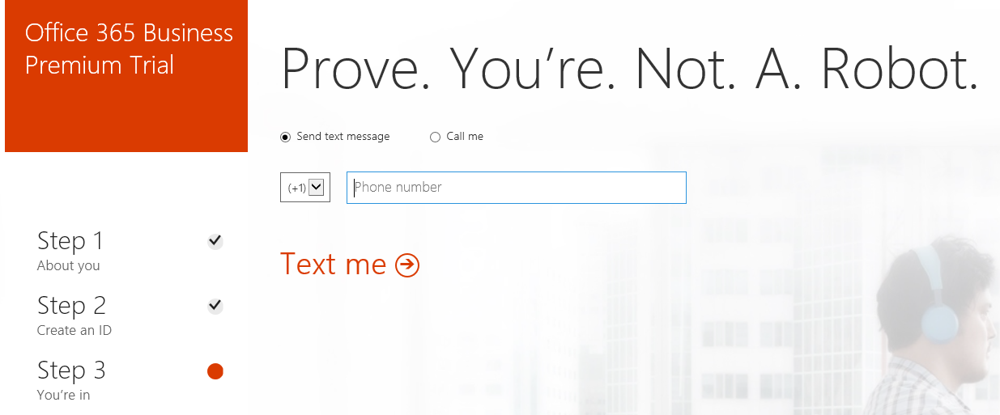
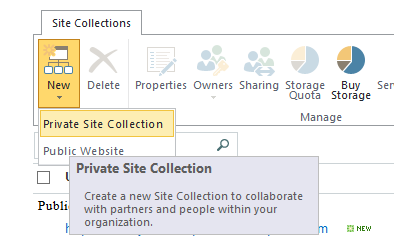
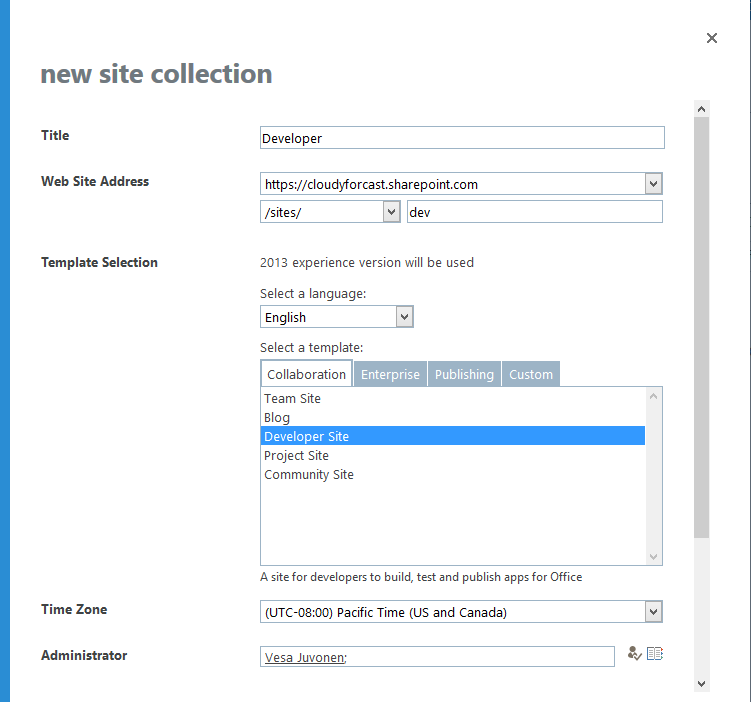
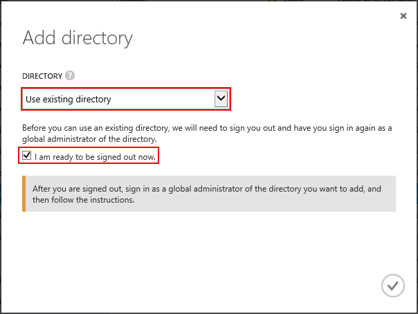
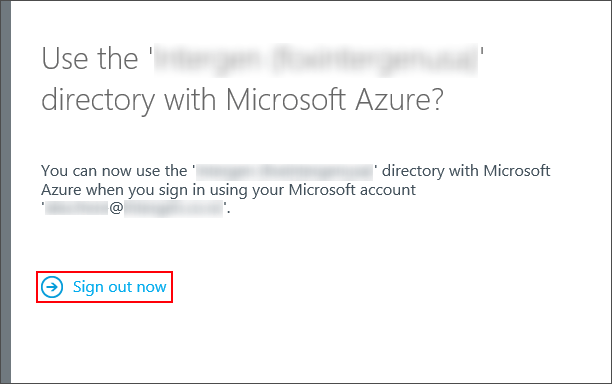

Module 02 - Setting up the Environments
=======================================

##Overview
In this lab, you will create a cloud development environment and build a cloud-hosted app. The development environment will consist of a trial subscription to Office 365 and Azure.

##Objectives
- Set up a developer trial subscription to Office 365
- Set up a developer trial subscription to Microsoft Azure
- Create a basic cloud-hosted app to test the environment

##Prerequisites
- Visual Studio 2013 for Windows 8

##Exercises
The hands-on lab includes the following exercises: 
1. <a href="#Exercise1">Obtain Office 365 and Azure subscriptions</a> 
2. <a href="#Exercise2">Create a Provider-Hosted App</a> 
3. <a href="#Exercise3">Access a Database using MVC5</a> 
4. <a href="#Exercise4">Deploy the App to Production</a> 

##Exercise 1: Obtain Office 365 and Azure subscriptions
In this exercise you obtain trial subscriptions to Office 365 and Azure. If you already have these subscriptions, you can skip this exercise.

###Task 1 - Sign up for an Office 365 developer subscription
Follow these steps to sign up for an Office 365 developer subscription.
### Request new tenant. ###
  
1. **Start** Internet Explorer 

2.  Browse to address http://office.microsoft.com/en-us/business/redir/XT103040319.aspx 
  a.  This is the trial request for E3 tenants. You can also find the link to this trial option from http://office.microsoft.com. 
  NOTE: The trial request page link may have moved since the writing of this lab. You may need to search for the link in the sub-pages under **Plans & Pricing.**
  

3.  Fill out the form with your personal information accordingly (phone number, email address , company name etc.) and click the ** next ** button below the form to move to next step. 
    

4.  Choose your username and password and click the ** Next ** button below then move to next step. 
    

5.  Enter your mobile phone number, click **Text me**
    
6.  You should be able to recive a register code in a few minutes. Put the code to text box click **Create my account**
    

7.  Remember the information and click the ** You're ready to go ** button below to start the provisioning process. 
  a.  Notice that this is a trial tenant which does not cause you any additional costs, and you don’t have to continue using it afterwards.
    
 
 
8.  Wait for the initial provisioning actions to be completed. This could take anywhere from a few minutes to a half an hour.
    

9.  Click on **SharePoint** from the **Admin** menu. The SharePoint option will be available from the menu, when the tenant provisioning is completed.
    

10.  Choose **Private Site Collection** from the **New** menu.
    

11.  Request new site collection with following settings and click **OK** to proceed with the developer site collection creation
  a.  Title – **Developer**
  b.  Web Site Address – **http://[yourtenant].sharepoint.com/sites/dev**
  c.  Template Selection – **Developer Site**
  d.  Administrator – Your admin account which was provisioned during the tenant provisioning
  e.  Storage Quota – **200 MB**
    
 
12.  Creation of the site collection will take a while, but after it has been created, you are ready to proceed with the actual training exercises.
  a.  Each of the exercise will use the just created developer site collection URL as the target site collection for testing and deploying, so you want to remember this URL during the exercises.

You now have an Office 365 developer subscription to use with the remaining labs.

###Task 2 - Sign up for a Microsoft Azure trial subscription
Follow these steps to sign up for an Azure trial subscription.

1. Navigate to the [Azure Management Portal](https://manage.windowsazure.com)
2. Log in with your account, or create one if you don't have one
Here we will associate your Azure account with your O365 tenant as a global administrator.
This gives you the ability to manage the O365 directory using the Azure portal.

01. Sign into the [Azure Portal](https://manage.windowsazure.com/)

02. Click **+ New**

    

03. Select **App Services > Active Directory > Directory > Custom Create**

    

04. Select **Use existing directory**, and then **I am ready to be signed out now**

    

05. You will be signed out of the portal and redirected to a sign-in page. Sign in using the credentials for a global
    administrator in your O365 tenant.

    

06. When authenticated click **continue**. This will add your Azure account as a global administrator of the O365
    directory.

    

07. Click **Sign out now** and when prompted sign back into your Azure account.

    

You have successfully associated your Azure account with your O365 tenant as a global administrator.
This gives you the ability to manage the O365 directory using the Azure portal.

You now can now use your Microsoft Azure  subscription to use with the remaining labs.

##Exercise 2: Create an excel and SharePoint add-in using the Napa Development Tools
### Install the Napa Tools
1. Navigate to the developer site you created in exercise 1. It should be something like http://<your-site>.sharepoint.com/sites/dev
2. Select build an app.
3. You'll be redirected to the SharePoint Store.
  and will need to add it   Continue through the prompts, add the app to your site, and trust it.

### Create an add-in for Excel
1. Navigate back to your developer site (something like http://<your-site>.sharepoint.com/sites/dev) 
2. Select build an app.
3. Click on the Task Pane app for Office option. Name your Task Pane Project and click create.
4. Delete Everything inside the `<body></body>` tag

5. Add the following code
 
	`

<h1>Welcome!</h1>        

      
          
<strong>Select text and find related Flickr images.</strong>
                   <button id="get-data-from-selection">Search Flickr</button>      

`

6. Navigate to Home.js.    In `if (result.status === Office.AsyncResultStatus.Succeeded) {` replace the content with : 
`app.showNotification('The selected text is:', '"' + result.value + '"');                showImages(result.value);`

7. Add the showImages Function
    `function showImages(selectedText) {$('#Images').empty();var parameters = {tags: selectedText,tagsmode: "any",format: "json"};$.getJSON("https://secure.flickr.com/services/feeds/photos_public.gne?jsoncallback=?", parameters,function (results) {$.each(results.items, function (index, item) {$('#Images').append($("").attr("src", item.media.m));});});}`

8. Run the add in.

9. Start the App, and test it out!

##Summary
By completing this hands-on lab you learnt how to:
- Provision an Office 365 developer tenancy.
- Provision a Microsoft Azure subscription.
- Create a Provider-Hosted app.
- Utilize an Entity Framework model with SQL Azure data.
- Publish the remote web to Microsoft Azure.
- Publish an app to SharePoint.
- Add a SharePoint app to a site.
